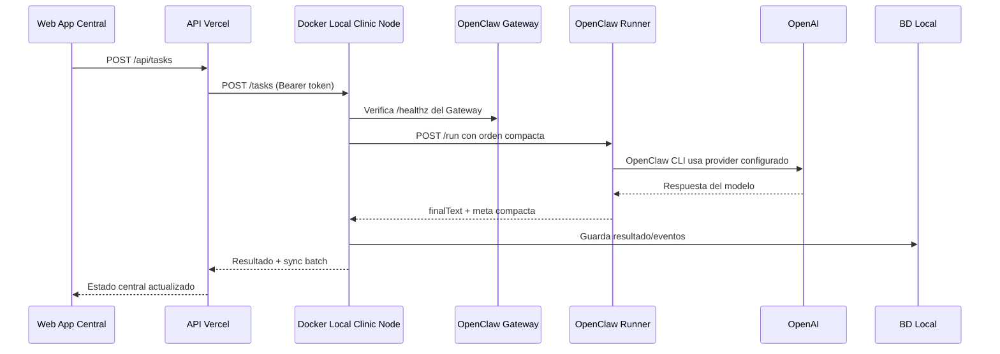

# Arquitectura hibrida Lux Aeterna

## Modelos base

| Modelo | Rol | Uso recomendado |
| --- | --- | --- |
| Web App centralizada | UI, reportes, contabilidad, multi-clinica, admins | Vercel + API central + base de datos cloud |
| Docker con OpenClaw | Automatizacion local, citas/correos, offline-first, conectores internos | Un contenedor por clinica/cliente |
| Hibrido | Central coordina, local ejecuta, sync bidireccional | Produccion recomendada |

## Contrato central-local

## Seguridad minima

- Token por nodo local (`LOCAL_NODE_TOKEN`) para acciones de escritura.
- El endpoint `/health` puede ser publico para monitoreo basico; `/tasks`, `/sync/now` y `/events` deben protegerse.
- En produccion, agregar mTLS, rotacion de secretos y auditoria por evento.
- No enviar PHI innecesaria a servicios externos. El nodo local debe filtrar/redactar datos antes de sincronizar reportes centrales.

## OpenClaw

El prototipo puede usar `OPENCLAW_MODE=mock` para probar sin dependencia externa. Para pruebas reales, el adaptador usa `OPENCLAW_MODE=gateway`, consulta el Gateway en `OPENCLAW_GATEWAY_URL` validando `/healthz`, y ejecuta tareas de modelo por `OPENCLAW_RUNNER_URL`.

El runner vive en `ops/openclaw-runner/server.mjs`, escucha en `18889`, exige `LOCAL_NODE_TOKEN` y devuelve solo `finalText` y metadatos basicos del modelo. La API key se carga por `env_file` desde WSL y no se versiona.

OpenClaw se debe ejecutar con permisos minimos por clinica. Si se habilitan herramientas de shell/filesystem, se recomienda montar solo las carpetas necesarias y usar allowlists de comandos, conectores y rutas.
